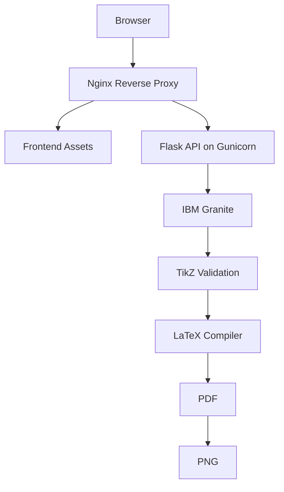

# AI-LaTeX Diagram Generator


Generate publication-ready LaTeX TikZ diagrams from natural-language prompts using IBM Granite on IBM watsonx.ai.

The project includes a Flask backend, completed frontend, IBM Granite integration, TikZ cleanup and validation, LaTeX compilation, PDF output, PNG previews, image upload, diagram refinement, Docker packaging, Gunicorn startup, structured logging, security headers, rate limiting, and production configuration.

## Live Deployment

Public application URL: `pending-cloud-deployment`

The repository is deployment-ready. Replace this value with the HTTPS URL from Render, Railway, Google Cloud Run, or Azure App Service after the production deployment is created.

## Architecture



The browser frontend sends prompts, refinement requests, and image uploads through Nginx to the Flask API running on Gunicorn. The API calls IBM Granite for TikZ generation, normalizes and validates the TikZ, compiles it with LaTeX, generates a PDF, renders a PNG preview, and returns artifact URLs to the frontend.

Full architecture documentation is available in [SYSTEM_ARCHITECTURE.md](SYSTEM_ARCHITECTURE.md). Additional Mermaid diagrams are also mirrored in [docs/diagrams.md](docs/diagrams.md):

- System Architecture
- Request Flow
- Docker Deployment
- Sequence Diagram

## Features

- Natural-language diagram generation with IBM Granite 4 H Small.
- Diagram refinement using existing TikZ and natural-language instructions.
- Reference image upload support for PNG, JPG, and JPEG files.
- TikZ cleanup and validation before compilation.
- LaTeX, PDF, and PNG artifact generation.
- Static generated artifact download routes.
- Structured logging with request timing.
- JSON-only error handling for production APIs.
- Security headers via Flask-Talisman.
- Rate limiting via Flask-Limiter.
- Docker, Docker Compose, Nginx, Gunicorn, and cloud-compatible startup.
- GitHub Actions CI for tests, syntax checks, Docker build, and container startup verification.

## Screenshots

The frontend renders generated PNG previews returned by the API at `/generated/images/<filename>`.

### Demo GIF

Demo GIF placeholder: add `docs/demo.gif` for the GitHub release page or portfolio case study.

| View | Description |
| --- | --- |
| Prompt workspace | Main AI diagram generation interface with prompt input, upload support, progress states, and result history. |
| Preview workspace | PDF and PNG preview tabs with zoom, fit-to-screen, fullscreen, code viewer, and downloads. |
| Error workspace | Collapsible compiler details with TikZ source and retry controls. |

Release screenshots can be captured from the running frontend after submitting a prompt and receiving a generated diagram.

## Project Structure

```text
AI-LaTeX-Diagram-Generator/
|-- .github/
|   |-- ISSUE_TEMPLATE/
|   |-- workflows/
|   `-- pull_request_template.md
|-- backend/
|   |-- app.py
|   |-- compiler.py
|   |-- granite.py
|   |-- image_processor.py
|   |-- prompt_template.py
|   `-- tikz_generator.py
|-- frontend/
|   |-- index.html
|   |-- script.js
|   `-- style.css
|-- data/
|   `-- generated/
|-- nginx/
|   |-- certs/
|   `-- default.conf
|-- docs/
|   `-- diagrams.md
|-- scripts/
|   `-- validate_env.py
|-- tests/
|-- uploads/
|-- API_REFERENCE.md
|-- CHANGELOG.md
|-- CODE_OF_CONDUCT.md
|-- CONTRIBUTING.md
|-- DEPLOYMENT.md
|-- DEPLOYMENT_CHECKLIST.md
|-- Dockerfile.cloud
|-- Dockerfile
|-- docker-compose.yml
|-- gunicorn.conf.py
|-- LICENSE
|-- README.md
|-- RELEASE_CHECKLIST.md
|-- requirements.txt
|-- ROADMAP.md
|-- SECURITY.md
|-- SYSTEM_ARCHITECTURE.md
`-- .env.example
```

## Installation

Create and activate a virtual environment:

```bash
python -m venv .venv
```

Windows:

```bash
.venv\Scripts\activate
```

Linux or macOS:

```bash
source .venv/bin/activate
```

Install Python dependencies:

```bash
pip install -r requirements.txt
```

Install a LaTeX distribution and ensure `pdflatex` is available on `PATH`.

## Environment Variables

Create `.env` from `.env.example` and set the values for your environment.

| Variable | Default | Description |
| --- | --- | --- |
| `IBM_API_KEY` | Required | IBM watsonx.ai API key. |
| `IBM_PROJECT_ID` | Required | IBM watsonx.ai project ID. |
| `IBM_URL` | Required | IBM watsonx.ai service URL. |
| `MODEL_ID` | `ibm/granite-4-h-small` | IBM Granite model identifier. |
| `IBM_GRANITE_MODEL_ID` | Optional | Backward-compatible model identifier alias. |
| `IBM_WATSONX_MAX_RETRIES` | `3` | Retry count for Watsonx generation calls. |
| `PORT` | `5000` | HTTP port for Docker and deployment platforms. |
| `NGINX_HTTP_PORT` | `8080` | Host port used by Docker Compose for the Nginx reverse proxy. |
| `LOG_LEVEL` | `INFO` | Python logging level. |
| `MAX_PROMPT_LENGTH` | `3000` | Maximum accepted prompt or refinement instruction length. |
| `MAX_UPLOAD_SIZE` | `10485760` | Maximum upload size in bytes. |
| `REQUEST_TIMEOUT` | `60` | Timeout in seconds for compilation and Gunicorn workers. |
| `WORKERS` | `2` | Gunicorn worker count. |
| `VALIDATE_ENV_ON_START` | `true` | Validate production environment variables before container startup. |
| `GUNICORN_GRACEFUL_TIMEOUT` | `30` | Seconds Gunicorn waits for workers to finish during restart or shutdown. |
| `GUNICORN_KEEPALIVE` | `5` | Gunicorn keep-alive timeout in seconds. |
| `GUNICORN_WORKER_CLASS` | `sync` | Gunicorn worker class. |
| `GUNICORN_PRELOAD_APP` | `false` | Preload the Flask app before worker fork when set to `true`. |
| `FORWARDED_ALLOW_IPS` | `*` | Gunicorn trusted proxy forwarding IP list. |
| `UPLOAD_FOLDER` | `uploads` | Folder for uploaded images. |
| `GENERATED_FOLDER` | `data/generated` | Folder for generated LaTeX, PDF, PNG, and work files. |
| `RATELIMIT_STORAGE_URI` | `memory://` | Flask-Limiter storage backend URI. |

## Running Locally

Start the backend:

```bash
python backend/app.py
```

The API runs at:

```text
http://127.0.0.1:5000
```

Serve the frontend:

```bash
python -m http.server 8000
```

Open:

```text
http://localhost:8000/frontend/
```

## Docker

Copy the sample environment file and fill in the IBM watsonx.ai values before starting containers:

```bash
cp .env.example .env
```

Build the image:

```bash
docker build -t ai-latex-diagram-generator .
```

Run the container:

```bash
docker run --env-file .env -p 5000:5000 ai-latex-diagram-generator
```

Run the production-style stack with Docker Compose:

```bash
docker compose up --build
```

Open the frontend through Nginx:

```text
http://localhost:8080
```

Docker Compose starts two services:

- `backend`: Flask on Gunicorn, bound to internal port `5000`.
- `nginx`: reverse proxy and static frontend server, exposed on `NGINX_HTTP_PORT`.

Generated files and uploads are stored in Docker volumes so container restarts do not remove runtime artifacts. The image creates required runtime folders, runs as a non-root user, writes logs to stdout/stderr, validates environment variables on startup, and exposes a `/health` Docker healthcheck.

## Deployment

### Production Gunicorn

The container starts with:

```bash
python scripts/validate_env.py && gunicorn --config gunicorn.conf.py backend.app:app
```

`gunicorn.conf.py` reads `PORT`, `WORKERS`, `REQUEST_TIMEOUT`, `LOG_LEVEL`, `GUNICORN_GRACEFUL_TIMEOUT`, `GUNICORN_KEEPALIVE`, and related settings from the environment. Access logs are emitted as structured JSON-like lines to stdout, which keeps Docker, Render, Railway, Azure, and Cloud Run log collection straightforward.

### Nginx Reverse Proxy

`nginx/default.conf` serves the completed frontend, proxies `/health`, `/generate`, `/upload`, `/refine`, and `/generated/` to the backend container, applies security headers, enables gzip, and sets a `10m` upload body limit that matches the default `MAX_UPLOAD_SIZE`.

The local Compose stack runs HTTP by default. For self-managed HTTPS, place `fullchain.pem` and `privkey.pem` in `nginx/certs/`, mount them read-only, and add a `443 ssl` server block using the commented certificate paths in `nginx/default.conf`. Managed platforms commonly terminate TLS before traffic reaches the container.

### Environment Validation

Startup validation is controlled by `VALIDATE_ENV_ON_START`. When enabled, the container refuses to start unless `IBM_API_KEY`, `IBM_PROJECT_ID`, and `IBM_URL` are set and integer settings such as `PORT`, `WORKERS`, `MAX_UPLOAD_SIZE`, and `REQUEST_TIMEOUT` are valid positive numbers.

### Render

1. Create a new Web Service from the repository.
2. Select Docker as the runtime and use the included `Dockerfile`.
3. Set `IBM_API_KEY`, `IBM_PROJECT_ID`, `IBM_URL`, and any optional environment variables.
4. Keep `VALIDATE_ENV_ON_START=true`.
5. Set the health check path to `/health`.

Render supports Docker-based deploys from a repository Dockerfile and provides runtime environment variables to the container.

### Railway

1. Create a Railway service from the repository.
2. Deploy with the included `Dockerfile`.
3. Set the required IBM watsonx.ai variables in the service environment.
4. Let Railway provide the public proxy; the container reads `PORT` when the platform sets it.
5. Use `/health` for service checks if configured.

Railway supports Dockerfile-based builds from the project repository.

### Azure App Service

1. Build and push the Docker image to a registry Azure App Service can pull from.
2. Create a Web App for Containers using that image.
3. Add `IBM_API_KEY`, `IBM_PROJECT_ID`, `IBM_URL`, and production settings as App Settings.
4. Set `WEBSITES_PORT=5000` when running the Flask/Gunicorn container directly.
5. Configure health checks for `/health`.

Azure App Service injects App Settings as environment variables. For custom containers, set `WEBSITES_PORT` when the app listens on a port other than the platform default.

### Google Cloud Run

1. Build and push the Docker image to Artifact Registry.
2. Deploy the image to Cloud Run.
3. Store IBM credentials as environment variables or secrets.
4. Let Cloud Run inject `PORT`; the Gunicorn config binds to `0.0.0.0:$PORT`.
5. Use `/health` as the health endpoint if you enable probes.

Cloud Run requires the ingress container to listen on `0.0.0.0` using the injected `PORT`. Cloud Run terminates TLS before requests reach the container, so in-container HTTPS is not required.

### General Container Platform

1. Build from the included `Dockerfile`.
2. Set `IBM_API_KEY`, `IBM_PROJECT_ID`, and `IBM_URL`.
3. Let the platform provide `PORT`, or set `PORT=5000` for local runs.
4. Keep `WORKERS` and `REQUEST_TIMEOUT` sized for the deployment plan.
5. Use `/health` for readiness and liveness checks.

GitHub Actions runs on every push and pull request. The workflow installs dependencies, checks syntax, runs tests, builds the Docker image, starts the container, and verifies `/health`.

Use [DEPLOYMENT_CHECKLIST.md](DEPLOYMENT_CHECKLIST.md) before publishing a production deployment. Use [RELEASE_CHECKLIST.md](RELEASE_CHECKLIST.md) before tagging a GitHub release.

See [DEPLOYMENT.md](DEPLOYMENT.md) for Render, Railway, Google Cloud Run, and Azure App Service instructions using Docker, Gunicorn, Nginx, HTTPS, secrets, health checks, restart behavior, and post-deploy verification.

## IBM Granite Integration

The backend uses IBM Granite through IBM watsonx.ai to generate, refine, and repair TikZ code. The Granite integration:

- Loads credentials from environment variables or `.env`.
- Uses `MODEL_ID` or `IBM_GRANITE_MODEL_ID`, defaulting to IBM Granite 4 H Small.
- Sends strict prompts that require a single `tikzpicture` environment.
- Retries transient Watsonx failures.
- Sends compiler feedback back to Granite for automatic TikZ repair.

Live generation requires valid `IBM_API_KEY`, `IBM_PROJECT_ID`, and `IBM_URL` values.

## API Reference

The full API reference is available in [API_REFERENCE.md](API_REFERENCE.md).

All error responses are JSON:

```json
{
  "success": false,
  "error": "Invalid request."
}
```

### GET /health

Returns service health and version information.

Example:

```bash
curl http://127.0.0.1:5000/health
```

Response `200`:

```json
{
  "status": "healthy",
  "service": "AI LaTeX Diagram Generator",
  "model": "IBM Granite 4 H Small",
  "version": "1.0.0"
}
```

Status codes:

- `200`: Service is healthy.

### POST /generate

Generates TikZ, PDF, and PNG artifacts from a prompt.

Example:

```bash
curl -X POST http://127.0.0.1:5000/generate \
  -H "Content-Type: application/json" \
  -d "{\"prompt\":\"Draw a flowchart with Start, Process, Decision, and End.\"}"
```

Request:

```http
POST /generate
Content-Type: application/json
```

```json
{
  "prompt": "Draw a flowchart with Start, Process, Decision, and End."
}
```

Success response `200`:

```json
{
  "success": true,
  "tikz": "\\begin{tikzpicture}\n\\node[draw] {Start};\n\\end{tikzpicture}",
  "pdf": "/generated/pdf/diagram.pdf",
  "png": "/generated/images/diagram.png",
  "tex": "/generated/latex/diagram.tex",
  "job_id": "diagram",
  "message": "Generation successful"
}
```

Status codes:

- `200`: Request completed. Check `success` for generation or compilation result.
- `400`: Missing, empty, whitespace-only, or oversized prompt.
- `415`: Request body is not JSON.
- `429`: Rate limit exceeded.
- `500`: Unexpected server error.

### POST /upload

Uploads a reference image.

Example:

```bash
curl -X POST http://127.0.0.1:5000/upload \
  -F "file=@diagram.png"
```

Request:

```http
POST /upload
Content-Type: multipart/form-data
```

Use multipart field name `file`.

Success response `200`:

```json
{
  "success": true,
  "filename": "diagram-abc123.png",
  "message": "Upload successful"
}
```

Status codes:

- `200`: Upload succeeded.
- `400`: Missing file field, missing filename, or empty file.
- `413`: File exceeds `MAX_UPLOAD_SIZE`.
- `415`: Unsupported file extension.
- `429`: Rate limit exceeded.
- `500`: Unexpected server error.

### POST /refine

Refines existing TikZ using a natural-language instruction.

Example:

```bash
curl -X POST http://127.0.0.1:5000/refine \
  -H "Content-Type: application/json" \
  -d "{\"instruction\":\"Move the database node left\",\"tikz\":\"\\begin{tikzpicture}\\node[draw] {Database};\\end{tikzpicture}\"}"
```

Request:

```http
POST /refine
Content-Type: application/json
```

```json
{
  "instruction": "Move the database node to the left.",
  "tikz": "\\begin{tikzpicture}\n\\node[draw] {Database};\n\\end{tikzpicture}"
}
```

Success response `200`:

```json
{
  "success": true,
  "tikz": "\\begin{tikzpicture}\n\\node[draw] {Database};\n\\end{tikzpicture}",
  "pdf": "/generated/pdf/refined.pdf",
  "png": "/generated/images/refined.png",
  "tex": "/generated/latex/refined.tex",
  "job_id": "refined",
  "message": "Generation successful"
}
```

Status codes:

- `200`: Request completed. Check `success` for refinement or compilation result.
- `400`: Missing, empty, whitespace-only, or oversized instruction; missing TikZ.
- `415`: Request body is not JSON.
- `500`: Unexpected server error.

## Production Behavior

- `/generate` is limited to `10 requests/minute`.
- `/upload` is limited to `20 requests/minute`.
- Upload extensions are limited to `png`, `jpg`, and `jpeg`.
- Upload size is controlled by `MAX_UPLOAD_SIZE`.
- Prompt and refinement instruction length are controlled by `MAX_PROMPT_LENGTH`.
- Security headers include `X-Content-Type-Options`, `X-Frame-Options`, and `Referrer-Policy`.
- Unexpected exceptions are logged internally and never expose stack traces to clients.

## Troubleshooting

### Container exits immediately

Check that `IBM_API_KEY`, `IBM_PROJECT_ID`, and `IBM_URL` are set when `VALIDATE_ENV_ON_START=true`. For CI or health-only smoke tests, set `VALIDATE_ENV_ON_START=false`.

### `/health` does not respond

Confirm the container is listening on the expected port. Local Docker runs use `-p 5000:5000`; Docker Compose exposes Nginx at `http://localhost:8080` by default.

### LaTeX compilation fails

Review the `details` field returned by the API and the generated `.log` file under `data/generated/work/<job_id>/`. The Docker image includes TeX Live, TikZ, Poppler, and Ghostscript.

### PNG preview is missing

Ensure `pdftoppm` is available. It is included in the Docker image through `poppler-utils`.

### Rate limits are too strict

Configure `RATELIMIT_STORAGE_URI` for a shared backend such as Redis in multi-instance deployments. The default `memory://` storage is intended for single-instance runs.

### CORS blocks local frontend requests

The backend allows `http://localhost:8000` and `http://127.0.0.1:8000`. Use Docker Compose for the simplest production-style local setup because Nginx serves the frontend and proxies the API from one origin.

## Testing

Run the backend tests:

```bash
pytest
```

Run syntax checks:

```bash
python -m compileall backend tests
```

Run the same syntax target used by CI:

```bash
python -m py_compile backend/app.py backend/compiler.py backend/granite.py backend/image_processor.py backend/prompt_template.py backend/tikz_generator.py scripts/validate_env.py gunicorn.conf.py
```

## Contributing

See [CONTRIBUTING.md](CONTRIBUTING.md) for local setup, testing expectations, and pull request guidance.

Security reports should follow [SECURITY.md](SECURITY.md). Project direction is tracked in [ROADMAP.md](ROADMAP.md), and release history is tracked in [CHANGELOG.md](CHANGELOG.md).

## Future Improvements

See [ROADMAP.md](ROADMAP.md) for the full project roadmap.

Near-term roadmap:

- Persist generated artifacts in object storage.
- Add a shared rate-limit backend such as Redis for multi-instance deployments.
- Add authenticated user workspaces.
- Add optional cloud storage cleanup jobs.
- Add frontend release screenshots to project documentation.

## Acknowledgements

- IBM Granite and IBM watsonx.ai for model-backed TikZ generation.
- Flask, Gunicorn, Nginx, Docker, TeX Live, and Poppler for the production runtime stack.
- The open-source Python ecosystem used for testing, image processing, and deployment automation.

## License

This project is licensed under the MIT License.
