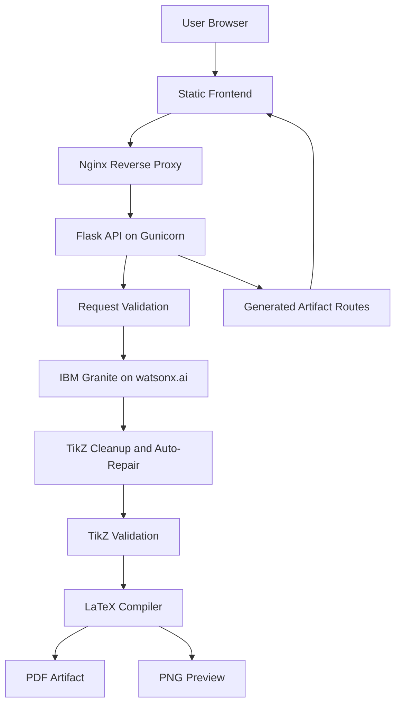
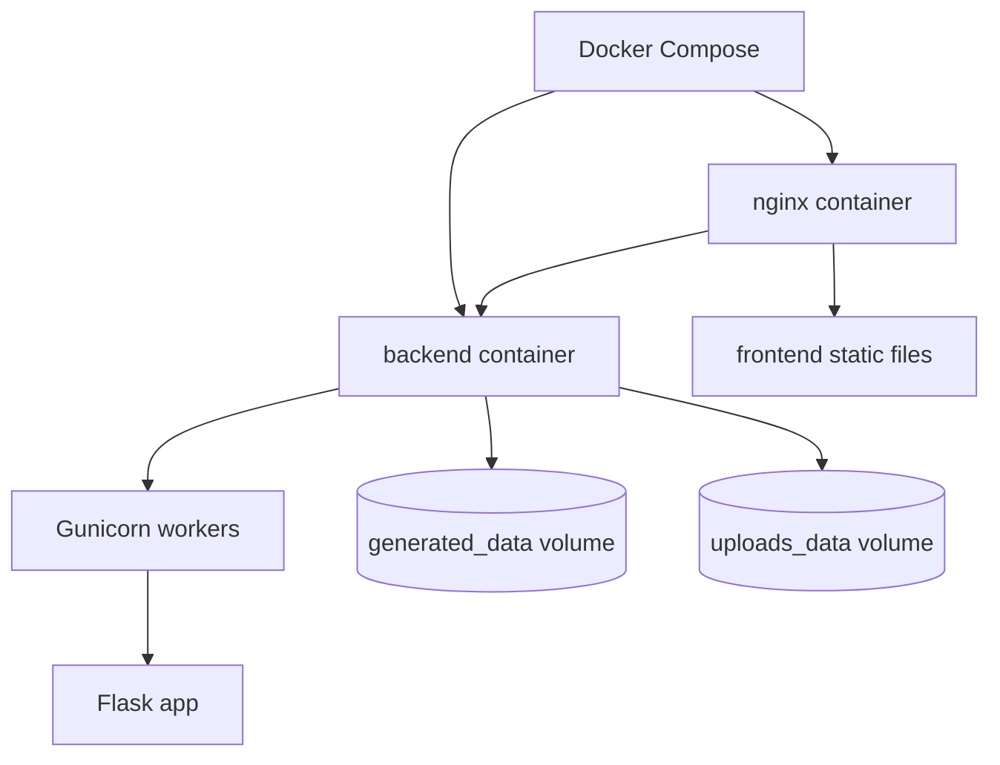
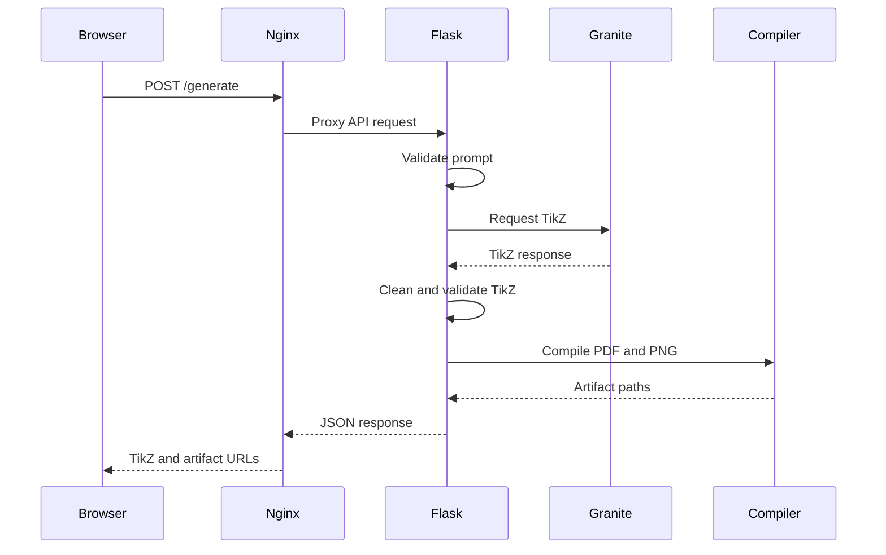

# System Architecture

AI-LaTeX Diagram Generator is a containerized Flask application that converts natural-language diagram requests into LaTeX TikZ, compiles the result into PDF, and renders PNG previews for the frontend.

## System Architecture

## Docker Deployment

## Generate Request Flow

```mermaid
flowchart LR
    Request[POST /generate] --> JSON[Validate JSON Prompt]
    JSON --> GraniteRequest[Send Prompt to Granite]
    GraniteRequest --> TikZ[Receive TikZ]
    TikZ --> Clean[Clean and Normalize]
    Clean --> Validate[Validate TikZ]
    Validate --> Compile[Compile PDF]
    Compile --> Preview[Create PNG]
    Preview --> Response[Return JSON Artifact URLs]
```

## Sequence Diagram

## Runtime Responsibilities

- Nginx serves frontend assets and proxies API routes.
- Gunicorn manages production Python workers.
- Flask validates requests, handles rate limits, and returns JSON responses.
- IBM Granite generates and repairs TikZ.
- LaTeX and Poppler produce PDF and PNG artifacts.
- Docker volumes preserve generated outputs and uploads across restarts.
