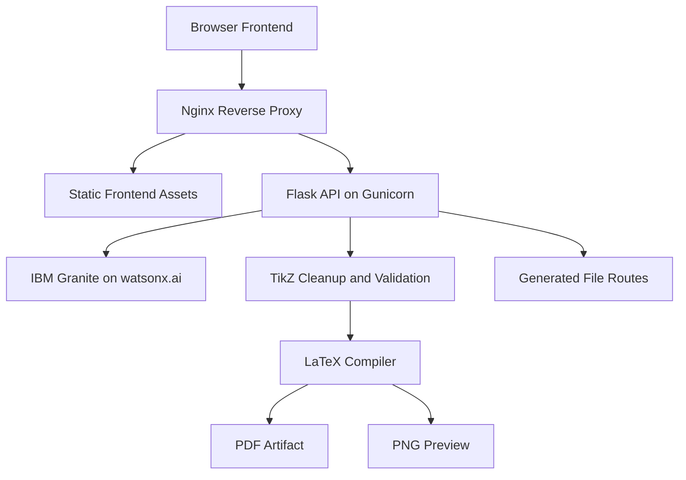
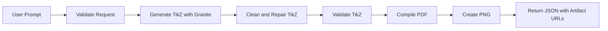
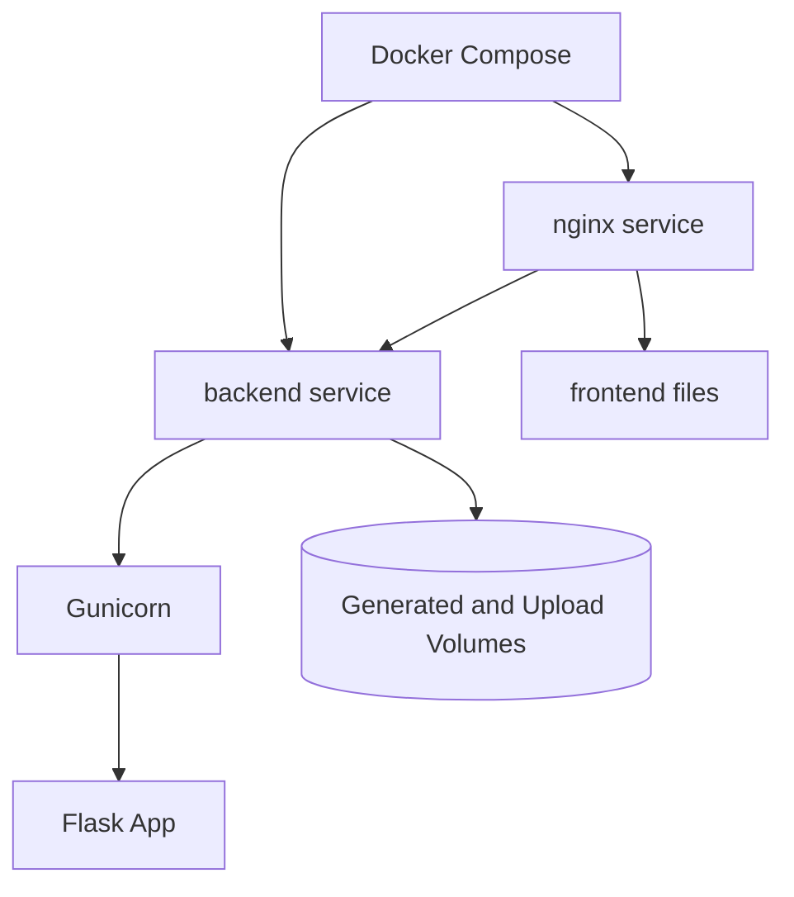
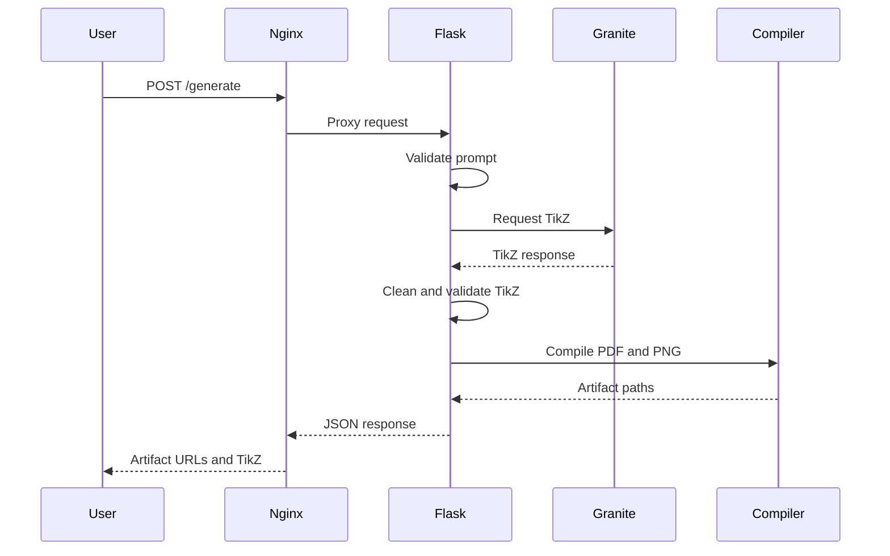

# Diagrams

## System Architecture

```mermaid
flowchart TD
    Browser[Browser Frontend] --> Nginx[Nginx Reverse Proxy]
    Nginx --> Static[Static Frontend Assets]
    Nginx --> API[Flask API on Gunicorn]
    API --> Granite[IBM Granite on watsonx.ai]
    API --> Validator[TikZ Cleanup and Validation]
    Validator --> Compiler[LaTeX Compiler]
    Compiler --> PDF[PDF Artifact]
    Compiler --> PNG[PNG Preview]
    API --> Generated[Generated File Routes]
```

## Request Flow

```mermaid
flowchart LR
    Prompt[User Prompt] --> Validate[Validate Request]
    Validate --> Generate[Generate TikZ with Granite]
    Generate --> Clean[Clean and Repair TikZ]
    Clean --> Check[Validate TikZ]
    Check --> Compile[Compile PDF]
    Compile --> Preview[Create PNG]
    Preview --> Response[Return JSON with Artifact URLs]
```

## Docker Deployment

```mermaid
flowchart TD
    Compose[Docker Compose] --> Backend[backend service]
    Compose --> Proxy[nginx service]
    Backend --> Gunicorn[Gunicorn]
    Gunicorn --> Flask[Flask App]
    Proxy --> Frontend[frontend files]
    Proxy --> Backend
    Backend --> Volumes[(Generated and Upload Volumes)]
```

## Sequence Diagram

```mermaid
sequenceDiagram
    participant User
    participant Nginx
    participant Flask
    participant Granite
    participant Compiler

    User->>Nginx: POST /generate
    Nginx->>Flask: Proxy request
    Flask->>Flask: Validate prompt
    Flask->>Granite: Request TikZ
    Granite-->>Flask: TikZ response
    Flask->>Flask: Clean and validate TikZ
    Flask->>Compiler: Compile PDF and PNG
    Compiler-->>Flask: Artifact paths
    Flask-->>Nginx: JSON response
    Nginx-->>User: Artifact URLs and TikZ
```
